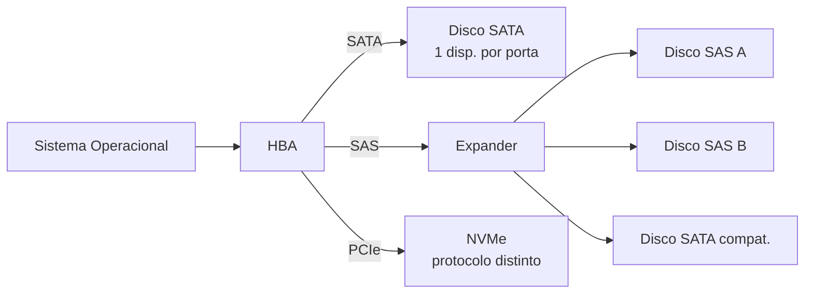
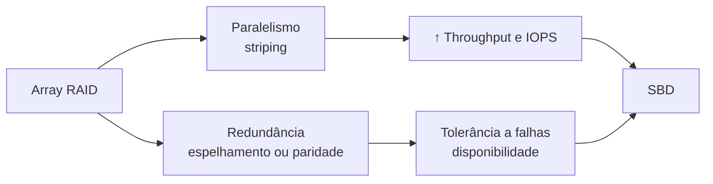
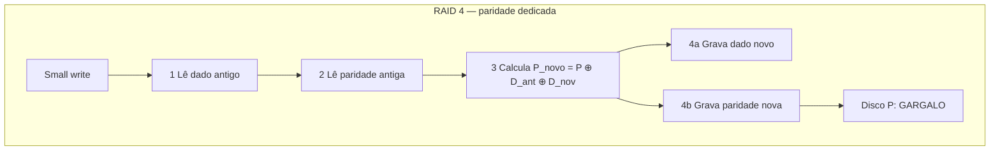
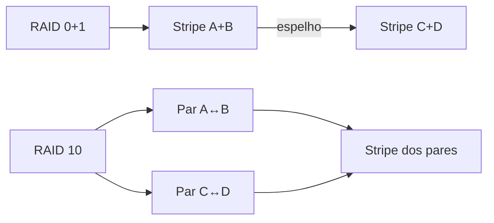

# Arquiteturas de Armazenamento Físico para SBD

DAS, Interfaces e Níveis de RAID

Daniel Rebouças de Sousa Barros — DRE 123273542 
Hugo Leandro Antunes — DRE 123143543 
Jeson Wen Chen — DRE 123051893 
João Batista Brasil Junior — DRE 121091172 
Pedro Cintra Silveira — DRE 123419342

Universidade Federal do Rio de Janeiro — Construção de Bancos de Dados 
Prof. Milton Ramirez — Setembro de 2026

<!-- Abrir com a pergunta: qual é o contrato de armazenamento que o database engine realmente assina com o disco? -->

---
layout: default
---

# O caminho de uma escrita durável

O commit só é seguro quando a confirmação chega ao ponto de durabilidade exigido pelo SGBD — não basta o dado estar no cache volátil do HBA.

<b>OLTP</b> Latência de cauda nas escritas síncronas (WAL flush)

<b>OLAP / Scans</b> Vazão sustentada em leituras sequenciais

<b>Rebuilds</b> Competição entre reconstrução e carga da aplicação

Síntese do relatório, seção 2

<!-- Explicar write-ahead logging e por que cache volátil invalida um commit confirmado ao cliente. -->

---
layout: default
---

# DAS e suas interfaces

| Interface | Taxa de enlace | Conexão / manutenção | Protocolo / aplicação |
|---|---|---|---|
| **SATA interno** | Até 6 Gb/s; 600 MB/s após 8b/10b | Cabo até 1 m; hot-plug condicionado | Comandos ATA; AHCI (programação). Capacidade econômica. |
| **eSATA** | Taxa da geração SATA suportada | Até 2 m; alimentação separada | Transporte SATA externo; expansão e backup. |
| **SAS-4** | 22,5 Gb/s por direção; 2.400 MB/s | Comprimento e filas dependem do produto; caminhos redundantes quando suportados | SCSI full-duplex; gerenciamento de storage missão crítica. |
| **FireWire** | Classes 400/800 Mb/s (50/100 MB/s) | Alcance depende do modo e meio | IEEE 1394; isócrono e assíncrono; instalações legadas. |
| **USB 3.2** | 5/10/20 Gb/s | Cabo compatível com o modo; hubs compartilham banda | SuperSpeed; BOT ou UASP para armazenamento. |
| **USB4 v2.0** | Até 80 Gb/s; opcional 120/40 Gb/s assimétrico | Cabos passivos 40 Gb/s ou ativos 80 Gb/s | PCIe/USB/DP tunelados; banda compartilhada. |
| **HBA** | Depende de PCIe e enlaces de storage | Hot-plug de discos e placa são recursos distintos | Passthrough ou RAID offload conforme o produto. |

Fontes: SATA-IO, T10/SAS-4, IEEE 1394-2008, USB-IF, SNIA Dictionary

<!-- NVMe é protocolo distinto sobre PCIe — não é modalidade SATA. AHCI é a interface de programação do controlador, não o protocolo físico. -->

---
layout: default
---

# SATA, SAS e o papel do HBA

## HBA passthrough
- Expõe discos ao SO
- RAID por software (mdadm, ZFS)
- CPU do host processa paridade

## Controladora RAID
- Volumes lógicos ao SO
- Cache protegido no adaptador
- Confirmar: BBU ou flash-backed

Cache volátil sem proteção não substitui persistência. Confirmar a política antes de confiar no ack de escrita.

Fontes: Intel AHCI Rev 1.3.1, Microchip Smart Storage, SNIA Dictionary

<!-- SAS com duas portas permite caminhos redundantes — depende do restante da instalação e do software multipath suportá-los. -->

---
layout: default
---

# Fundamentos de RAID: paralelismo e redundância

**Bit-level striping** 
Bit $i$ no disco $i$. 
Paralelo por byte; bloqueia todos os braços por requisição. Base do RAID 2.

**Byte-level striping** 
Byte $j$ no disco $(j \bmod n)$. 
Alta taxa sequencial; sem concorrência de requisições. Base do RAID 3.

**Block-level striping** 
Bloco lógico $i$ no disco $(i \bmod n)+1$. 
Equilíbrio: paralelismo em scans + concorrência em OLTP. Base do RAID 0, 4, 5 e 6.

Silberschatz, Korth e Sudarshan (2020), seção 12.5; Garcia-Molina, Ullman e Widom (2009), seção 13.3

<!-- A granularidade do strip size define o perfil de desempenho. Bit-level → RAID 2 (obsoleto). Byte-level → RAID 3 (sequencial). Block-level → base dos níveis modernos. -->

---
layout: default
---

# Mirroring, shadowing e paridade XOR

## Mirroring / shadowing (hardware)
- Cópias físicas idênticas em discos distintos — base do RAID 1
- Silberschatz e Elmasri usam os dois termos como sinônimos no contexto de hardware
- Leituras distribuídas entre cópias; escrita limitada pelo disco mais lento
- Reconstrução pela cópia sobrevivente — sem cálculo de paridade

## Paridade XOR
$$P = B_1 \oplus B_2 \oplus \cdots \oplus B_{n-1}$$
$$B_i = P \oplus B_1 \oplus \cdots \oplus B_{i-1} \oplus B_{i+1} \oplus \cdots$$

**Exemplo:** $D_0=1010$, $D_1=1100$, $D_2=0110$ → $P=0000$. 
Perdido $D_1$: $D_1 = P \oplus D_0 \oplus D_2 = 1100$ ✓

<b>Shadow paging</b> é técnica <em>transacional</em> distinta: mantém estado anterior das páginas para garantir atomicidade no SGBD — não é redundância de disco.

Silberschatz (2020) §12.5; Elmasri (2016) §16.10

<!-- O erro clássico é confundir mirroring (hardware) com shadow paging (recuperação lógica do SGBD). São camadas diferentes. -->

---
layout: default
---

# Métricas de confiabilidade

| Métrica | O que mede | Fórmula-chave |
|---|---|---|
| **MTTF** | Tempo médio até falha de um componente | $\text{MTTF}_\text{grupo} = M/n$ |
| **MTTR** | Tempo médio de reparo + reconstrução | janela de vulnerabilidade |
| **MTBF** | Intervalo médio entre falhas (sistema reparável) | $\text{MTBF}_\text{op} = U;\quad T_\text{ciclo} = U+D$ |
| **MTTDL** | Tempo médio até perda permanente de dados | depende do nível |

$$\text{MTTDL}_{\text{RAID 5}} \approx \frac{M^2}{n(n-1)R} \qquad \text{MTTDL}_{\text{RAID 6}} \approx \frac{M^3}{n(n-1)(n-2)R^2}$$

Reduzir $R$ (MTTR) à metade <b>duplica</b> o MTTDL de RAID 5 e <b>quadruplica</b> o de RAID 6. Hot spares reduzem $R$ sem aumentar paridades.

Silberschatz (2020) §12.5; modelo de Markov com reparo serial — hipóteses detalhadas no relatório

<!-- Esses modelos excluem erros latentes, falhas correlacionadas e falhas de controladora. São para análise de sensibilidade, não garantias. -->

---
layout: default
---

# Níveis de RAID padrão

Fontes: Patterson et al. (1988); Silberschatz (2020); Elmasri (2016); Red Hat RHEL 8

| Nível | Mín. | Capacidade | Falhas tol. | Escrita | Aplicação em SBD |
|---|---|---|---|---|---|
| **0** | 2 | $nC$ | 0 | Sem overhead | Temporários reconstruíveis |
| **1** | 2 | $C$ | $m-1$ em $m$ cópias | Replicada | WAL, logs e metadados |
| **2** | ECC | $kC$ | 1 (Hamming) | Coordenada | Histórico — ECC agora interno ao disco |
| **3** | 3 | $(n-1)C$ | 1 | Todos os discos | Histórico — byte-level, sequencial |
| **4** | 3 | $(n-1)C$ | 1 | RMW 4 I/Os + gargalo paridade | Raramente usado; RAID 5 substitui |
| **5** | 3 | $(n-1)C$ | 1 | RMW 4 I/Os — paridade distribuída | OLAP, leitura intensa |
| **6** | 4 | $(n-2)C$ | 2 | RMW 6 I/Os — dupla paridade | Arrays grandes, discos $\geq$ 4 TB |
| **0+1** | 4 | $nC/2$ | 1 garantida | Replicada | Preterido frente ao RAID 10 |
| **10** | 4 | $nC/2$ | 1 por par | Replicada | OLTP pesado, missão crítica |

<!-- RAID 4: o disco de paridade participa de toda escrita → ponto único de contenção. RAID 5 distribui paridade eliminando esse gargalo. -->

---
layout: default
---

# RAID 4 vs. RAID 5: o gargalo de paridade

**RAID 4 → 4 I/Os físicos por small write** 
Disco de paridade participa de **toda** escrita → ponto único de contenção

**RAID 5 → mesmos 4 I/Os, mas paridade distribuída** 
Na stripe $k$, paridade no disco $(k \bmod n)$ → contenção balanceada entre todos

Escrita de stripe completa elimina as 2 leituras (calcula paridade direto dos dados novos), mas o disco de paridade ainda participa.

Silberschatz (2020) §12.5; Gopinath, USENIX FREENIX 2000

<!-- Por isso RAID 4 praticamente não é usado. O RAID 5 resolve o gargalo sem custo de capacidade adicional. -->

---
layout: default
class: compact-raid10
---

# RAID 0+1 vs. RAID 10: tolerância real

**RAID 0+1** 
Perder disco A → stripe inteira degradada. 
Perder C depois → espelho **inteiro** comprometido.

**RAID 10** 
Perder A → apenas par (A,B) degradado. 
Perder C → apenas par (C,D) degradado. 
**Tolera A+C simultaneamente.**

RAID 10 tolera até n/2 falhas <em>desde que não sejam no mesmo par</em>. Reconstrução localizada: só o par afetado é reconstruído.

Silberschatz (2020) §12.5; Garcia-Molina (2009) §13.4

<!-- "Tolerar duas falhas" em RAID 10 depende de *quais* discos falham. RAID 0+1 tem tolerância muito mais frágil. -->

---
layout: default
---

# RAID não padrão: variantes proprietárias

| Variante | Fabricante | Redundância | Falhas tol. | Destaque | Limitação |
|---|---|---|---|---|---|
| **RAID 1.5** | HighPoint (ATA legado) | Espelhamento total | 1 | Redundância em 2 discos com leitura pelos dois | Dependência de controladora legada |
| **RAID 7** | Storage Computer Corp. | Específica do produto | Conforme config. | Cache centralizado; RTOS reduz latência percebida | Proprietário; limitado pelo destage e pelos discos |
| **RAID-DP** | NetApp / ONTAP | Duas paridades (RDP) | 2 | Proteção dupla sem duplicar capacidade | Tamanho de grupo específico do ONTAP |
| **RAID-S** | EMC / Symmetrix | Paridade por volume | 1 (config. 3+1) | 75–87,5 % de eficiência; XOR no disco | Hardware e microcódigo Symmetrix |
| **Matrix** | Intel RST | Volumes mistos (ex.: 0+1) | Por volume | Dois volumes no mesmo conjunto físico | Falha física afeta ambos os volumes |

Número maior ≠ maior confiabilidade. Cada variante exige documentação específica do produto para avaliar proteção, capacidade e recuperação.

HighPoint HPT370/372N manual; Storage Computer Form 10-K (SEC); Corbett et al. FAST 2004; Quinn/EMC NASA 1996; Intel RST

<!-- RAID-DP usa Row-Diagonal Parity (RDP): dois conjuntos de XOR independentes — não é apenas duplicar a paridade do RAID 5. -->

---
layout: default
---

# Desempenho normal, degradado e em rebuild

**Normal** 
RAID 5/6: lê dados diretamente. 
RAID 1/10: distribui leituras entre cópias.

**Degradado** 
RAID 5: toda leitura do dado ausente exige reconstrução via XOR com os sobreviventes. 
RAID 6: depende de quantos e quais discos falharam.

**Rebuild** 
Compete por banda e IOPS com a aplicação. 
Não existe fator universal de perda de desempenho — medir latência de cauda e percentis.

RAID não substitui backup. Corrupção lógica e deleção acidental propagam-se às cópias. Uma cópia só está pronta depois de um restore testado.

Krioukov et al., FAST 2008; Paszkiewicz / SPDK RAID5f (2024); Red Hat RHEL 8

<!-- Write hole: queda de energia entre a gravação do dado e da paridade deixa o array inconsistente. Cache protegido ou journal mitigam. -->

---
layout: default
---

# Integração DAS + RAID no SBD

| Carga SBD | Interfaces candidatas | RAID candidato | Justificativa |
|---|---|---|---|
| **WAL / logs** | SATA, SAS ou NVMe/PCIe | 1 ou 10 | Escrita sequencial; avaliar cache protegido e durabilidade |
| **Dados OLTP** | SAS ou NVMe/PCIe | 10 | Escritas aleatórias intensas; sem penalidade de paridade |
| **OLAP / DW** | SATA ou SAS | 5 ou 6 | Capacidade vs. proteção; RAID 6 para discos grandes |
| **Backup externo** | eSATA / USB 3.2 / USB4 | 1 ou sem RAID | Redundância local; backup independente é obrigatório |
| **Temporários** | Qualquer | 0 | Somente conteúdo reconstruível / descartável |
| **Legado** | FireWire | Conforme equipamento | Compatibilidade existente; não é recomendação para novos SBDs |

Banda da interface deve superar a I/O agregada dos discos. Hot spare encurta o MTTR e impacta diretamente o MTTDL de RAID 5 e 6.

Síntese do relatório, seção 10 — recomendações são ponto de partida; medições da carga real orientam a decisão final

<!-- Separar volumes só reduz interferência quando eles não convergem ao mesmo gargalo físico (controladora, enlace PCIe ou canal SAS compartilhado). -->

---
layout: default
---

# Casos e verificações práticas

<b>PostgreSQL em RAID 1 (WAL)</b> Espelhamento sem penalidade de paridade; durabilidade depende do cache e do fsync.

<b>OLTP em RAID 10 + SAS</b> Full-duplex + caminhos redundantes; reconstrução localizada ao par afetado.

<b>OLAP em RAID 5 + SATA</b> Custo/TB favorável; avaliar MTTR em discos grandes — RAID 6 se risco for alto.

<b>RAID-DP (NetApp ONTAP)</b> Dupla paridade (RDP); tamanho de grupo e política de rebuild específicos do sistema.

## Antes de produção, testar

- Perder um disco, um caminho e uma controladora
- Reiniciar durante escrita e durante rebuild
- Medir latência normal e degradada
- Restaurar backup integral e pontual

## Revisões desta pesquisa

- Distinção AHCI/SATA/NVMe como protocolos separados
- Byte-level striping separado de bit-level
- MTTDL com hipóteses do modelo explicitadas
- RAID 7 sem tolerância universal afirmada
- Limiares de RAID 6 removidos — decisão por carga e risco

Prompts e correções: seção Post-Mortem do relatório

<!-- A IA confundiu mirroring de hardware com shadow paging transacional. Revisão contra Silberschatz, Elmasri e documentação primária foi indispensável. -->

---
layout: end
class: conclusion-final
---

# Conclusão

## A decisão começa pela carga exigida pelo database engine

- **Interface:** banda, latência, manutenção e caminhos redundantes antes de escolher o nível RAID.
- **RAID 10** é candidato natural para OLTP intenso — sem cálculo de paridade, reconstrução localizada.
- **RAID 5 / 6** aproveitam melhor a capacidade; RAID 6 suporta uma falha adicional ao custo de escrita.
- **RAID 0** restrito a dados descartáveis — MTTDL menor que um disco isolado.
- **Nenhum nível RAID substitui backup independente testado.**
